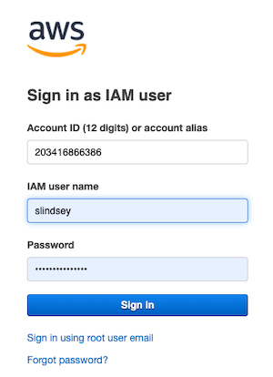
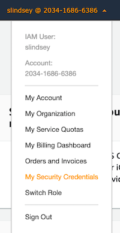
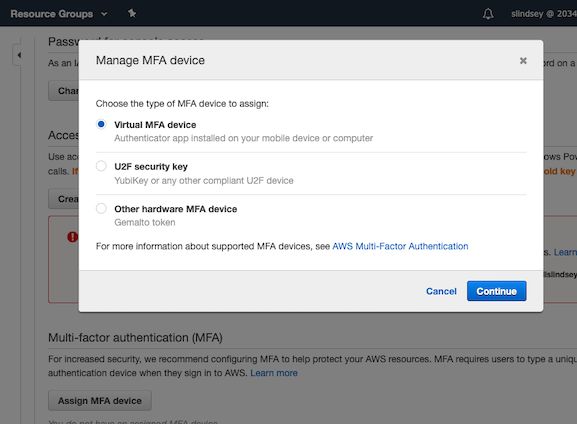
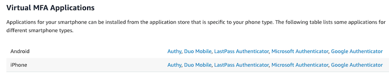
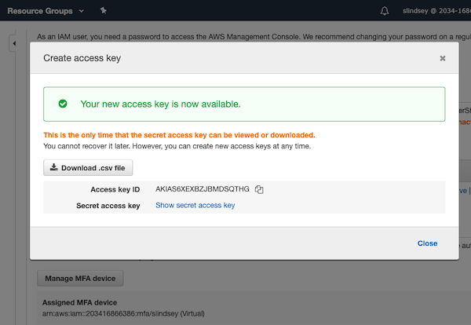

## Cloud Services Integration { #cloudservices }

Frontera's design includes a totally new integration with cloud services, providing users with new options for data storage and access to emerging computing technologies. 

For projects utilizing data of exceptional importance - such as may result from an especially difficult physical experiment or a long-running simulation that is impractical to repeat - users have access to a cloud-based storage mirror that provides protection beyond the level already provided with TACC's redundant archive storage system. This capability relies upon the storage solutions of our cloud partners Microsoft, Google, and Amazon. For users who need this level of data protection, we provide storage capacity during the term of Frontera's operation by awarding credits for users to store data with our cloud partners. 

Users may access emerging computational capabilities (such as Tensor processors) that run on specially-designated processors at Google, Microsoft, and Amazon. This allows us to regularly refresh the project with novel computing technologies, while providing a real-world platform for users to explore the future of their science applications.

!!!note 
	04/30/2025 TACC no longer offers Microsoft's Azure service.

### Google Cloud Platform { #cloudservices-google }

TACC now offers Frontera users access to Google Cloud Platform.

#### Request Access { #cloudservices-google-requestaccess }

Please [create a support ticket][HELPDESK] requesting access to TACC Frontera's Google Cloud Platform. Do not proceed with the following steps until an admin has responded and configured your account appropriately.


1. Install

	Follow these detailed instructions to install the Google Cloud SDK on Linux platforms: [Installing Google Cloud SDK](https://cloud.google.com/sdk/docs/install#linux).

1. Download and extract

	```cmd-line
	login1$ curl -O https://dl.google.com/dl/cloudsdk/channels/rapid/downloads/google-cloud-sdk-335.0.0-linux-x86_64.tar.gz
	login1$ tar -xzf google-cloud-sdk-335.0.0-linux-x86_64.tar.gz
	```

1. Authenticate and configure

	```cmd-line
	login1$ ./google-cloud-sdk/bin/gcloud auth login
	```

	* You'll be presented a URL to paste into a browser; Log in using the appropriate Google account. 
	* You'll then be presented an authentication string. Copy and paste this string when promped with: "Enter verification code:".  
	* Configure the CLI for the correct project. For Frontera, use `ut-tacc-np-sandbox-1`.

	```cmd-line
	login1$ ./google-cloud-sdk/bin/gcloud config set project ut-tacc-np-sandbox-1
	```

#### Storage basics { #cloudservices-google-storage }

Learn the basic `gsutil` commands: [Quickstart: Using the `gsutil` tool](https://cloud.google.com/storage/docs/quickstart-gsutil)

**Example: list storage elements:**

```cmd-line
login1$ ./google-cloud-sdk/bin/gsutil ls
```

### Amazon Web Services (AWS) { #cloudservices-amazon }

TACC now offers Frontera users access to Amazon Web Services. 

#### Request Access { #cloudservices-amazon-requestaccess }

Please [create a support ticket][HELPDESK] requesting access to TACC Frontera's Amazon Web Services. Do not proceed with the following steps until an admin has responded and configured your account appropriately.

#### Log In to the Console { #cloudservices-amazon-login }

If you are a new user then you should have received an email "Welcome to Amazon Web Services" containing a temporary password. Follow the instructions below to set up your AWS account.

Log in to the [Amazon Web Services Console](https://console.aws.amazon.com) with the following information: 

* Enter "203416866386" in the "Account ID" field 
* Enter your [Frontera User Portal](https://frontera-portal.tacc.utexas.edu/) ID in the "IAM user name" field.
* New users enter the temporary password contained in your welcome email, then reset your password.  
	<figure id="login"> 
	<figcaption></figcaption></figure>

#### Add MFA { #cloudservices-amazon-mfa }

Follow these instructions to enable MFA on your account. **Do not navigate away from the MFA window during the pairing process, or else your account may be left in an unstable state.** 

1. From the top menu "username@2034-1686-6386", select "My Security Credentials"  
	<figure id="securitycredentials"> 
	<figcaption></figcaption></figure>

1. Click on the "Assign MFA device" button in the "Multi-factor authentication (MFA)" section. Then, select the "Virtual MFA device" option and click "Continue".  
	<figure id="managemfadevice"> 
	<figcaption></figcaption></figure>

1. Choose an Authentication method. Scroll down to see a list of free options. Many TACC users employ Duo Mobile or Google Authenticator. Open the authenticator app of your choice, scan the displayed QR code to add the account, then input the MFA codes as directed. 
	<figure id="mfaapplications"> 
	<figcaption></figcaption></figure>

1. Once the pairing process is completed, sign out and then log back in. **You will not be able to successfully proceed to the next step without doing so.**

#### Add CLI and API access key { #cloudservices-amazon-keys }

!!! important
	You must set up MFA and use it to log in to the AWS console prior to viewing or editing your access keys.

1. Once again, select "My Security Credentials" from the top menu, then click the "Create access key" button in the "Access keys for CLI, SDK, & API access" section.  
	<figure id="accesskeyavailable"> 
	<figcaption></figcaption></figure>

1. Install CLI: Follow the instructions at <https://docs.aws.amazon.com/cli/latest/userguide/install-cliv2.html>.
1. For more info see [Managing Access Keys for IAM Users](https://docs.aws.amazon.com/IAM/latest/UserGuide/id_credentials_access-keys.html)

#### All Set { #cloudservices-amazon-allset }

Now that your account is set up, you have access to the AWS S3 functionality. See the full documentation at <https://docs.aws.amazon.com/s3/index.html>.


